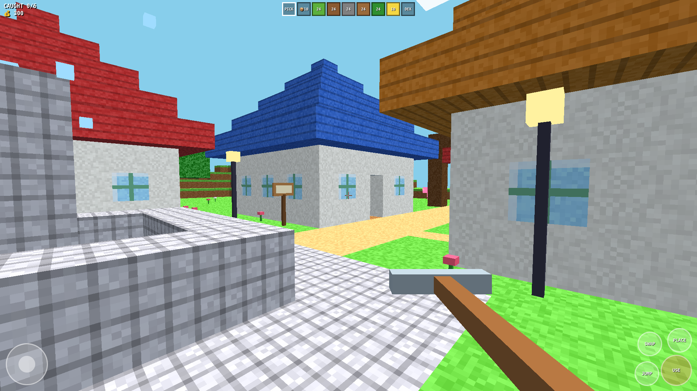
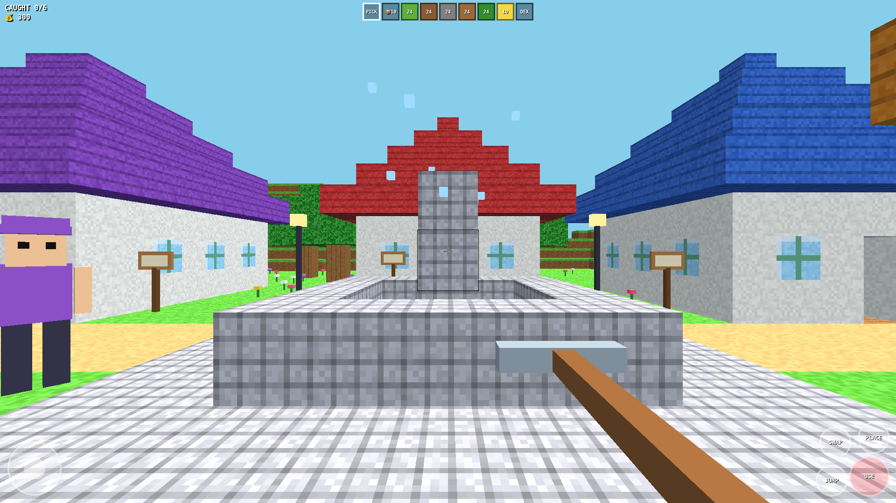

# CUBEMON

**CUBEMON** — a Pokémon × Minecraft style voxel creature game for the web. Catch wild Cubes, battle, build, and explore a Caribbean island town. One HTML file, touch-ready, plays in any phone browser.

🎮 **Play it now:** https://dwele88.github.io/cubemon/

## What it is

You drop into a voxel Caribbean town — chattel houses, royal palms, corner shops, street lamps — and the wild Cubes are out there waiting. Catch them, grow your collection, and roam across multiple islands.

## Features

- 🏝️ **Caribbean island town** — Bridgetown-inspired blocks with shopfronts, palms, and chattel houses
- 🌙 **Day/night cycle** — the town shifts from bright day to streetlamp-lit night
- 🗺️ **GTA-style circular minimap** — always know where you are
- 💰 **Money HUD** — earn as you play
- 👾 **Catchable creatures** — track, battle, and collect Cubes across the islands
- 📱 **Touch-ready** — full on-screen controls for phones, plus keyboard on desktop
- 📦 **Single file** — the whole game is one HTML file, no build step, no server needed

## Controls

**Phone / touch:**
- Left stick — move
- SWAP / PLACE / JUMP / USE buttons — interact, build, jump, use

**Desktop:**
- WASD / arrows — move
- Mouse — look
- E — use / interact
- Space — jump

## Run it yourself

No install. Either play at the link above, or:

1. Download `index.html`
2. Open it in any browser — that's it

## Built by

Andwele Earle — made with AI-assisted game dev, Caribbean to the core. 🌴
